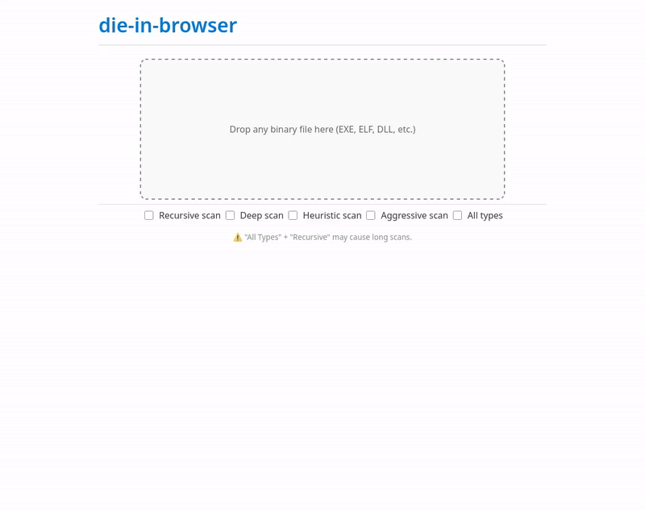

# die-in-browser

> Static binary analysis with **Detect It Easy** — 100% in your browser, no
> uploads.

<p align="center">
  
</p>

## 🔍 What is this?

This project runs
**[Detect It Easy (DIE)](https://github.com/horsicq/Detect-It-Easy)** — a
powerful static binary analyzer — entirely inside your browser using the
**[v86 emulator](https://github.com/copy/v86)**.

- ✅ **No file uploads**: binaries are processed locally.
- ✅ **Full analysis**: all detections, entry point, sections (in PE file),
  hashes, entropy, strings.

### Built with:

- [**Buildroot 2025.11**](https://buildroot.org) – minimal Linux system for the
  guest OS;
- [**v86**](https://github.com/copy/v86) – x86 emulator in
  JavaScript/WebAssembly;
- [**Detect It Easy 3.10 (`diec`)**](https://github.com/horsicq/Detect-It-Easy)
  – console version of DIE for headless analysis;
- **Docker** – for reproducible builds;

## 🚀 Try it now

👉 **[Live Demo](https://die-in-browser.deno.dev)**

📂 **[Source Code](demo)** – demo source code

> ⚠️ Everything runs in your browser — the initial load includes a ~25 MB
> emulator state file. Also, large binaries may take longer to analyze.

## 📦 Use as a Library

You can embed this analyzer directly into your own web app.

### Option 1: Use prebuilt assets

Download everything you need from the
**[Releases](https://github.com/xoreaxlmbdx/die-in-browser/releases)** page:

- `v86.wasm`, `libv86.js`
- BIOS files (`seabios.bin`, `vgabios.bin`)
- Compressed emulator state (`buildroot-state.bin.zst`)

> 💡 The `buildroot-state.bin.zst` file contains a full snapshot of the Linux
> system with DIE preinstalled and is approximately **25 MB** in size.

### Option 2: Build it yourself

Follow the instructions in the next section.

Then:

1. Place the files in your project directory.
2. Put `die.js` in the same folder.

📌 See the `library/` folder for usage example and full API docs.

## 🛠️ Build from source

**Prerequisites**: Docker with BuildKit enabled.

```bash
git clone https://github.com/xoreaxlmbdx/die-in-browser.git
cd die-in-browser
./build.sh
```

The build output will appear in `./build/` and includes:

- `v86.wasm`, `libv86.js`
- `seabios.bin`, `vgabios.bin`
- `licenses.tar.gz`
- `v86state-*.bin.zst` (compressed emulator snapshot)

## 🙌 Acknowledgements

- v86 emulator — [copy/v86](https://github.com/copy/v86);
- Detect It Easy —
  [horsicq/Detect-It-Easy](https://github.com/horsicq/Detect-It-Easy);
- Buildroot config — [humphd/browser-vm](https://github.com/humphd/browser-vm);
- [Buildroot](https://buildroot.org);

## 📝 License

MIT — free to use and modify.

> 📄 The build includes a `licenses.tar.gz` archive (generated by Buildroot)
> that contains license texts for all components used in the guest system.
